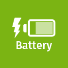
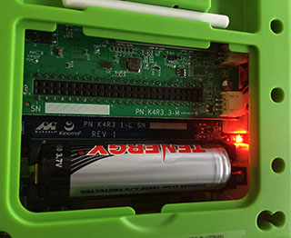

<!-- Version: 160412-KO / Last reviewed: December 2015

Power can be provided to Kinoma Create from either of the two USB ports or from the battery. This Tech Note provides full details on power source requirements for Kinoma Create.-->

#Kinoma Create Power and Charging

**Mike Jennings, QA Program Manager**  
December 20, 2014

Power can be provided to Kinoma Create from either of the two USB ports or from the battery. Either port can supply sufficient power to keep Kinoma Create running indefinitely when connected to a modern PC or powered USB hub; however, most such connections cannot deliver enough current to charge the battery.

The only way to charge the battery is by connecting the Micro-USB port to a high-current, sensing charging block with a cable designed for high-current charging; Kinoma Create is supplied with that type of charger and cable.

For the fastest, most predictable results, use the charging system that came with Kinoma Create. However, since your application might require alternative arrangements for powering or charging your device, here are some more detailed specifications.

 
##Charging Details

Kinoma Create can run with power from either USB port; however, to operate the device *without charging or depleting the battery*, the charger must provide at least .5A@5V; unpowered USB hubs (hubs that do not come with a power supply of their own) and many PC USB ports are not sufficient.

*No* charging (not even trickle-charging or slow-charging) will occur unless the charging block meets the following two criteria:

- The charger must supply at least 1.8A@5V.
 
- The charger must be the *high-current* type typically supplied with Android tablets, in which the data lines are shorted with a resistor of 200 ohms or less. This signals support for high-current charging per USB.org's [Battery Charging 1.2 Specification](http://www.usb.org/developers/docs/devclass_docs/) (which forms the basis for Chinese and EU standards) and avoids overloading notebook and other standard-current USB chargers and hubs. Computer USB ports cannot short the data lines together, therefore *using a computer to power the device will not charge the battery*. 

   Note also that chargers designed exclusively to deliver high-current charging for Apple iPads use a different signaling scheme that is not compatible with EU standards and will not charge the battery.

Additionally, the cable used between the device and the charging block must not bear a DC resistance that drops the power-line voltage more than 100 mV. This is usually a function of length of the USB cable and the gauge of the power lines within it; it is hard to determine from the packaging, but if the packaging specifies the gauge of the power lines, look for a gauge of 24 or better (lower numbers are thicker and therefore better). On the cable itself there will often be printed something like "28AWG/1P+24AWG2C," where the figure ending in "2C" lists the wire gauge of the power wires--in this example, 24AWG or 24 gauge.

Since the charging circuit requires at least one high-current charger and (for battery safety considerations) the maximum charge current is 1.2A, using both ports will *not* charge the battery faster in any configuration.

A full charge should take about 2.5 hours for the supplied 2600 mAh battery, but charge rate is not linear. As with any battery charging system, the amount of current actually used to charge depends on the voltage level of the battery; at very low voltages (depleted battery) the charge rate will be only 120 mA ("pre-charge") until the battery voltage level reaches 3V, which will allow the full 1.2A to be used safely. Pre-charging typically takes 10-20 minutes. As the voltage approaches the top, the delivered current diminishes; therefore that last 5% or so will take a significant portion of the time. When the battery is fully charged, the charging circuit will automatically turn off until the voltage level of the battery drops by about 100 mV.

Figure 1 shows what the Battery app displays to indicate the battery is charging (a lightning-bolt graphic); the darker green inside the battery graphic indicates the current percentage of charge. If you are using a non-compatible charger or powering from an unpowered USB, the charging indicator is not displayed and the battery is not being charged.

**Figure 1.** Battery App Showing Charging Indicator  

##Replacement Batteries

Should you need a spare or a replacement, the battery is a 3.7V 2600 mAh standard protected Lithium-ion type 18650 battery. The positive end goes near the USB connectors. (A "+" is screened onto that side of the battery connector.) If it is inserted backward, a red light will illuminate near the battery (see Figure 2). 

**Figure 2.** Battery Inserted Incorrectly  

Note that the Battery app and even the firmware are calibrated to the [Tenergy 2600mAH](http://www.tenergy.com/30016) battery that is supplied with the device. Therefore, the Battery app may not be accurate with replacement batteries from other sources.