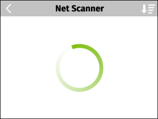
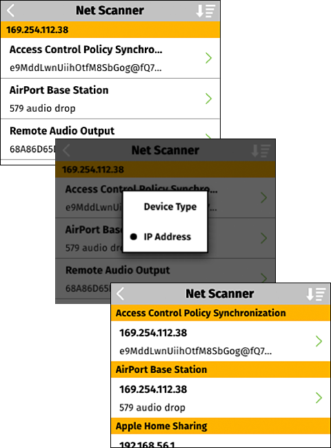
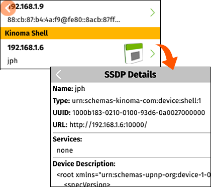
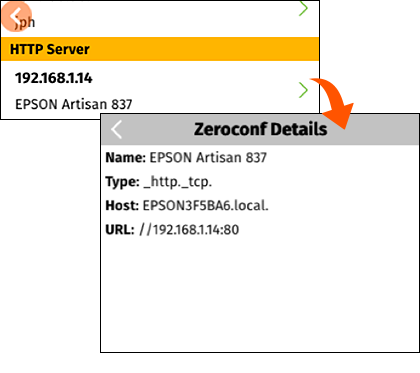

<!-- Version: 160415-CR / Last reviewed: November 2015

The Net Scanner application on Kinoma Create is a utility that shows you devices and network services available on your local network. Net Scanner looks for devices that announce their presence using the two most widely used discovery protocols: SSDP and Zeroconf.
-->

#Net Scanner

**Peter Hoddie**   
December 10, 2014

A fundamental aspect of building new Internet of Things devices is establishing connections between devices on your network, so they can work together. Net Scanner helps you develop those applications by showing you all the devices and services that your Kinoma Create can see. That eliminates the guesswork of wondering whether your application software is properly displaying the devices it has discovered, and whether it is properly interacting with the KinomaJS discovery API.

##About the Protocols 

SSDP is the more established of the two discovery protocols, first introduced in 1999 in an [RFC](http://tools.ietf.org/html/draft-cai-ssdp-v1-00) from Microsoft, and later integrated into the [UPnP](http://upnp.org) home networking standard. SSDP is supported by a wide range of devices, including televisions, Windows PCs, media servers, network routers, network cameras, and printers.

Zeroconf, also known as [mDNS](http://tools.ietf.org/html/rfc6762), is more recent, first introduced in 2002 by Apple under the consumer name Rendezvous and later renamed Bonjour. Zeroconf is used extensively by Apple hardware and software products and is widely supported on networked printers.

Some devices, particularly network printers, support both SSDP and Zeroconf discovery protocols, so they can be discovered by both Macintosh and Windows computers without the need for the user to install additional software.

There is no consensus as to whether Zeroconf of SSDP is the superior protocol. Both are widely used, so Kinoma Create supports both to help your software discover the device services you want your projects to work with.

##Using Net Scanner 

When you first launch Net Scanner, it sends discovery requests out on the Wi-Fi network your Kinoma Create is connected to. While scanning, Kinoma Create displays a spinner (Figure 1). Typically this spinner is visible for less than a second.

**Figure 1.** Net Scanner Spinner  

Net Scanner displays devices and their network services as soon as they are discovered. By default, Net Scanner organizes the services by the IP address of the device. This organization is useful for seeing all the network services provided by a particular device. Using the sort button at the top right of the screen, you can organize the services by their type (as shown in Figure 2), which is useful for seeing all the devices that support a particular network service--for example, an HTTP server--on your network.

**Figure 2.** Network Services by IP Address (Top) and Type (Bottom)  

Net Scanner displays a brief summary of each network service, a human-readable version of the service type, the name assigned to the service (which sometimes is useful and sometimes is a seemingly random string of text), and the IP address. If the SSDP service is associated with a UPnP device that provides an icon, Net Scanner attempts to display that.

Tap any network service to display the service details. The title of the details screen indicates which discovery protocol found the service, SSDP or Zeroconf. The details that appear in the content area depend on the service found and the discovery protocol used. For SSDP services, Net Scanner attempts to retrieve the XML device description, which is displayed when available (Figure 3). Zeroconf tends to have less information to display because of the relative simplicity of the protocol (Figure 4).

**Figure 3.** SSDP Details Screen  

**Figure 4.** Zeroconf Details Screen  

In the example in Figure 4, the Zeroconf service discovered an HTTP server service on an EPSON printer. Entering the URL of the printer into a web browser connected to the same Wi-Fi network will display the home page for the printer’s built-in web server.

Both SSDP and Zeroconf protocols cache remote discovery results to minimize network traffic. In some situations, the cache can become out of date; for example, when a previously discovered device crashes, it cannot notify other devices that it is leaving the network. When this happens, stale devices may appear in the Net Scanner results. The cache entries will time out after a period of time (up to 30 minutes, for UPnP devices).

##Sample Code
Having explored the services available on your Wi-Fi network using Net Scanner, you are probably inspired to support SSDP and Zeroconf in your projects. KinomaJS has support for SSDP and Zeroconf, both for discovering existing services and for advertising the services of your project running on Kinoma Create. Among the [KinomaJS samples](https://github.com/Kinoma/KPR-examples/) available are:

- [`discovery-client`](https://github.com/Kinoma/KPR-examples/tree/master/discovery-client) and [`discovery-server`](https://github.com/Kinoma/KPR-examples/tree/master/discovery-server) show a simple client-server pair communicating using the KinomaJS application sharing feature. Using Net Scanner, you can see that the discovery server advertises its presence using SSDP.

- [`ssdp`](https://github.com/Kinoma/KPR-examples/tree/master/ssdp) shows how to use the KinomaJS SSDP API directly to both scan for other network services and advertise your own project's services.

- [`sketchat`](https://github.com/Kinoma/KPR-examples/tree/master/sketchat) provides a multi-user drawing experience on Kinoma Create using both a color sensor and a motion sensor. Kinoma Create devices discover each other using SSDP and connect directly to share user drawings.

- [`dial-remote`](https://github.com/Kinoma/KPR-examples/tree/master/dial-remote) shows how to use SSDP to discover DIAL devices, and how to launch an application on the discovered devices. See the Tech Note [Using DIAL to Launch Apps Remotely](../using-dial-to-launch-apps-remotely/).

- [`zeroconf`](https://github.com/Kinoma/KPR-examples/tree/master/zeroconf) shows how to use Zeroconf to discover network services, such as web servers, available on your local network. It also shows how to use Zeroconf to advertise a simple HTTP server available inside your project.

> **Note:** If you do not have two Kinoma Create devices available yet to run these client server samples, you can run one of them on your Kinoma Create and the other on the Kinoma Create simulator in Kinoma Studio. Just make sure they are both on the same Wi-Fi network and there is no firewall on your computer shielding the Kinoma Create simulator.