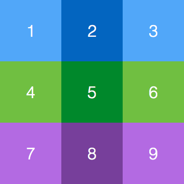
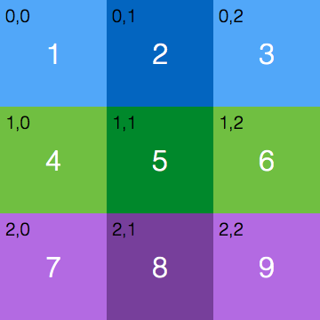

#Displaying Images and Media

KinomaJS includes many options for displaying images and media within your application. Both local images and those hosted on the web can be displayed as *textures* on a *skin* or as their own *picture* contents. *Media* can be streamed from the web or played from local sources.

This tutorial shows you how to incorporate images, sound, and video into your KinomaJS application. It covers loading of both local and remote media.

##Texture

The `texture` object is an asset that references an image file. A `texture` object is typically referenced by a `skin` object, enabling you to create skins that use images to fill the background of the `content` object whose appearance they define. 

To create your first texture, you will save an image into your `src` folder. Save the image in Figure 1 (or any other image) into your `src/assets` folder, naming it `kinoma-logo.png`.

**Figure 1.** Kinoma Logo  


>**Note:** In many of our examples, you will see that images and other media are in a subdirectory named `assets`; this is a convenient convention, but not a rule. 

All you need to pass in to create a texture is the URL of the image.

```
var kinomaLogo = new Texture("assets/kinoma-logo.png");
```
	
You can then create a skin that uses the texture. 

```
var kinomaSkin = new Skin({
	  width: 411, height: 383,
	  texture: kinomaLogo,
	  fill: "white",
	  aspect: "fit"
});
```
	
The width and height passed into the constructor define the size of the portion of the texture that will be visible. If you want the full image, be sure to set the width and height of the skin to match the dimensions of your image; if they are smaller, it will cut off part of the image. The next section demonstrates how using only a subset of an image at a time can be useful.

The *aspect* of a skin controls how its portion of its texture is scaled during rendering. For more details, see the section on aspect in the [*KinomaJS Overview*](../../../../../xs6/xsedit/features/documentation/docs/overview/overview.md)'s discussion of skins.

Now you can create a `content` object with the new skin and add it to your application.

```
var mainCon = new Content({ 
		top: 0, left: 0, height: 200, width: 200, 
		skin: kinomaSkin, 
});
application.add(mainCon);
```

###States and Variants

It is often convenient to store several icons or other user interface elements in a single image. This prevents you from having to reference many similar images in the same application. *States* and *variants* enable you to reference different sections of the same image.

An important distinction to be aware of before continuing any further is that all `content` objects have properties named `state` and `variant`, whereas all `texture` objects have properties named `states` and `variants`. These properties are very much related, but not the same.

The `states` and `variants` properties of a texture are numerical values. The `states` property represents the vertical offset between states, and the `variants` property represents the horizontal offset between variants. This will make more sense with an example.

Save the image in Figure 2 as `states-and-variants.png` in your `src/assets` folder.

**Figure 2.** Numbered Grid



To create a texture that references this image, add the following line to your `main.js` file.

```
var numberedGrid = new Texture("assets/states-and-variants.png");
```
	
Now you can use the texture in the constructor of a `skin` object and use states and variants to display each numbered square individually. Create a `content` object that uses your new skin.

```
var gridSkin = new Skin({
	  width: 120, height: 120,
	  texture: numberedGrid,
	  fill: "white",
	  variants: 120, states: 120,
});
	
var gridContent = new Content({ 
	top: 0, height: 120, width: 120, skin: gridSkin, 
	variant: 0, state: 0
});
```
	
This code creates a 120x120 `content` object with the light-blue square labeled 1 in the image. Let's unpack this code a bit.
	
Note that the actual image file is 360x360 pixels, but the skin is only 120x120 pixels, so only one of the colored squares will show at a time. You might try changing the height and width of the skin to 360 to see what it does.

Setting `variants` to 120 means that:

- When `gridContent`'s variant is 0, you will see one of the squares in the 120 leftmost pixels of the grid image--that is, 1, 4, or 7.

- When `gridContent`'s variant is 1, it will shift 120 pixels to the right, so you will see 2, 5, or 8. 

- When `gridContent`'s variant is 2, it will shift 120 more, so you will see 3, 6, or 9.

Setting `states` to 120 is the same idea but working vertically.

To clarify this visually, Figure 3 shows the grid image from Figure 2 labeled with *x, y* pairs where *x* is the state and *y* is the variant when the square they are in is being displayed.

**Figure 3.** Numbered Grid Showing State-Variant Pairs



The following code adds buttons to the screen that will enable you to quickly change the state and variant of the container. Add it to your `main.js` file.

```
var gridContent = new Content({ 
	top: 0, height: 120, width: 120, skin: gridSkin, 
	variant: 0, state: 0,
	behavior: Behavior({
		changeState: function(content, data){
			content.state = (content.state+1)%3;
		},
		changeVariant: function(content, data) {
			content.variant = (content.variant+1)%3;
		}
	})
});
	
var ChangeButton = Container.template($ => ({
	left: 10, right: 10, top: 20, bottom: 50, skin: new Skin({ fill: "gray" }),
	active: true,
	contents: [
		new Label({ string: $.string })
	],
	behavior: Behavior({
		onTouchEnded: function(container, data) {
			application.distribute( $.eventToDistribute );
		}
	})
}));
	
var mainCon = new Container({ 
	left: 0, right: 0, top: 0, bottom: 0, skin: new Skin({ fill:"white" }), 
	style: smallText, 
	contents: [
		new Label({ top: 20, height: 25, left: 0, right: 0, 
			string: "Skin with States/Variants Example" }),
		new Line({ top: 65, height: 150, left: 0, right: 0,
			contents: [
				new ChangeButton({ string: "State", 
					eventToDistribute: "changeState" }),
				gridContent,
				new ChangeButton({ string: "Variant", 
					eventToDistribute: "changeVariant" }),
			]
		 })
		
	]
})
application.add(mainCon);
```

The video in Figure 4 shows this example running on the Kinoma Create simulator.

**Figure 4.** Running the States/Variants Example

<iframe width="800" height="500" src="https://www.youtube.com/embed/RVef1twIALU?rel=0&amp;vq=hd1080" frameborder="0" allowfullscreen><a href="https://www.youtube.com/embed/RVef1twIALU?rel=0&amp;vq=hd1080">Watch Video</a></iframe>

##Pictures

The `picture` object is a `content` object that displays images referenced by a URL. You can use the standard `file`, `http`, or `https` scheme.

We will use the same `kinoma-logo.png` file from the earlier section on textures. To add the image to your project, create a `picture` object and add it to the application.

```
var kinomaLogo = new Picture({height: 200, url: "assets/kinoma-logo.png"});
application.add(kinomaLogo);
```

If you worked through the tutorial [Transforming Content at Runtime](../layers/layers.md), you may remember all the editable attributes of `layer` objects--opacity, rotation, and so on. You can edit `picture` objects in the same ways. For example, you can adjust the opacity of the picture you just made by adding the following line:

```
kinomaLogo.opacity = 0.5;
```

Refer to [Transforming Content at Runtime](../layers/layers.md) for more details on adjusting different attributes, or the section on the `picture` object in the [*KinomaJS Javascript Reference*](../../../../../xs6/xsedit/features/documentation/docs/javascript/javascript.md) document for the complete list of editable attributes.

##Media

The `media` object is a `content` object that plays an audio or video stream; for audio, it can also display the album art, if any. The stream is referenced by a URL, which commonly uses the `file`, `http`, or `https` scheme.

For a sample project that plays a video, see the [`media-player`](https://github.com/Kinoma/KPR-examples/tree/master/media-player) example on GitHub.